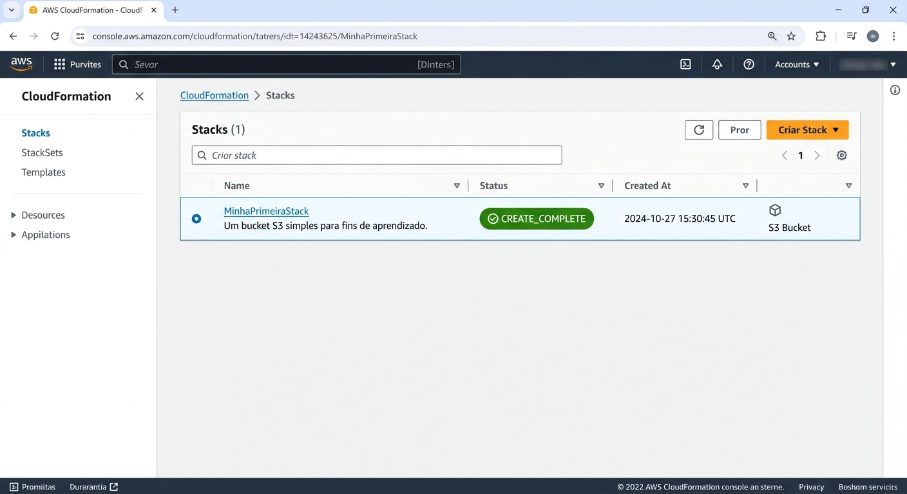

# Desafio de Projeto: Infraestrutura Automatizada com AWS CloudFormation.

**Curso:** Formação AWS Cloud Foundations.
**Instrutor:** Alexsandro Lechner (Arquiteto de Soluções AWS).

Este repositório foi criado para documentar meu aprendizado e a prática com a ferramenta **AWS CloudFormation**, como parte de um desafio prático na **Digital Innovation One (DIO)**.

O objetivo principal aqui foi entender como funciona o conceito de **Infraestrutura como Código (IaC)** na prática, usando modelos automatizados para criar e gerenciar recursos na nuvem da AWS.

---

## 📌 O que é o CloudFormation e por que usar?

Antes da prática, a principal ideia que ficou clara durante o módulo é: criar recursos na nuvem manualmente clicando no painel (console) toma tempo e abre margem para erros.

Com o **AWS CloudFormation**, nós escrevemos um arquivo de texto (chamado de *template* ou modelo, geralmente em YAML ou JSON) descrevendo exatamente o que queremos que a AWS crie. Ele funciona como uma "planta baixa" de uma casa: você entrega o desenho, e a AWS constrói tudo de forma automática.

### Benefícios do AWS CloudFormation:
- **Automação:** Ajuda a automatizar o processo de criação, configuração e gerenciamento de recursos da AWS com poucos cliques ou comandos.
- **Padronização:** Garante que os ambientes fiquem idênticos.
- **Controle de Versão:** Como a infraestrutura vira código, dá para guardar no GitHub e acompanhar as mudanças ao longo do tempo.

---

## 🛠️ Passos da Prática

Durante o laboratório, o processo seguiu esta estrutura básica:

1. **Entendimento da Estrutura do Template:**
   Análise das seções principais de um modelo do CloudFormation:
   - `AWSTemplateFormatVersion`: A versão do modelo.
   - `Description`: Uma breve explicação do que o código faz.
   - `Resources` *(obrigatório)*: Onde declaramos o que queremos criar (ex: uma instância EC2, um bucket S3 ou uma rede VPC).
   - `Parameters` e `Outputs`: Para deixar o modelo flexível e exibir informações úteis no final da execução.

2. **Criação da Stack (Pilha):**
   Subida do arquivo de modelo no painel da AWS para que a Stack fosse criada. Acompanhamento do status até aparecer a confirmação de sucesso (`CREATE_COMPLETE`).

3. **Verificação e Limpeza:**
   Conferência do recurso gerado no painel da AWS e, em seguida, exclusão da Stack para evitar custos desnecessários na conta.

---

## 📸 Print do Projeto

---

## 💡 Principais Aprendizados

- **Errar o código faz parte:** Se houver qualquer erro de sintaxe no arquivo, o CloudFormation faz o *rollback* (ou seja, ele desfaz tudo o que começou a criar), o que evita deixar recursos quebrados pela metade.
- **Atenção aos detalhes:** A indentação (espaçamento) no YAML precisa estar certinha para o arquivo ser aceito.
- **Organização no GitHub:** Registrar esse passo a passo ajuda no processo de fixação do conteúdo e serve como um guia rápido para quando eu precisar subir uma infraestrutura novamente no futuro.

---

## 📂 Estrutura do Repositório

- `README.md`: Este documento com anotações e explicações.

---

## 🌐 Conecte-se comigo

- **GitHub:** [HigorCamposGit](https://github.com/HigorCamposGit)

---
*Projeto desenvolvido para fins de estudo no curso da Formação AWS Cloud Foundations da DIO.*
